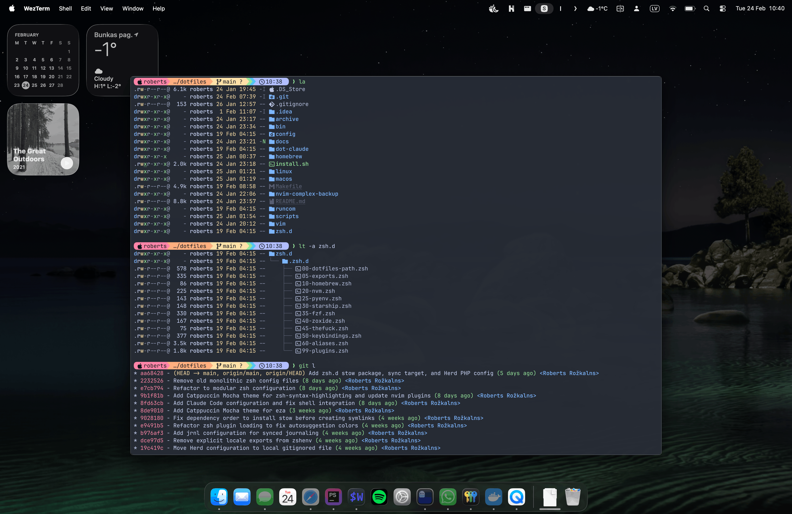

# Dotfiles

<a href="https://github.com/Rozkalns">
  <picture>
    <source media="(prefers-color-scheme: dark)" srcset="art/preview.png">
    
  </picture>
</a>

<p>
  
  
  
  
  
</p>

Personal development environment configuration for **macOS and Linux**.

**Repository:** [github.com/Rozkalns/dotfiles](https://github.com/Rozkalns/dotfiles)

## Table of Contents

- [Quick Start](#quick-start)
- [What's Included](#whats-included)
- [Installation](#installation)
- [Features](#features)
- [Customization](#customization)
- [Maintenance](#maintenance)
- [Work Computer Setup](#work-computer-setup)
- [Troubleshooting](#troubleshooting)
- [Credits](#credits)

## Quick Start

```bash
git clone git@github.com:Rozkalns/dotfiles.git ~/.dotfiles
cd ~/.dotfiles
make
```

## What's Included

### 🎨 Theme
- **Catppuccin Mocha** — consistent across Starship, Neovim, WezTerm, btop, Zsh

### 🐚 Shell
- **Zsh** with Starship prompt, syntax highlighting, and autosuggestions
- **Modern CLI tools** — bat, eza, fzf, ripgrep, zoxide, fd
- Custom aliases and functions

### ⌨️ Editors
- **Neovim** — minimal config with Catppuccin theme
- **Vim** — portable fallback

### 🖥️ Terminal
- **WezTerm** — GPU-accelerated with Catppuccin and custom keybindings

### 🍺 Package Management
- **Homebrew** — works on macOS and Linux
- Separate `Brewfile` (CLI tools) and `Caskfile` (GUI apps)

### 🍎 macOS Configuration
- Comprehensive system defaults (keyboard, trackpad, Finder, Dock)
- Automated Dock setup
- Default file associations
- Hot corner: bottom-left locks screen
- Touch ID for `sudo` (via `/etc/pam.d/sudo_local`, survives OS updates)

### 🔧 Utilities
- **GNU stow** — symlink management
- **Makefile** — task orchestration
- **bin/** — helper scripts (`is-macos`, `is-linux`, `is-executable`, etc.)
- **topgrade** — update everything with one command

## Installation

```bash
make              # Full install (auto-detects OS)
make macos        # macOS-specific
make linux        # Linux-specific
make link         # Symlinks only
make brew         # Packages only
make defaults     # macOS defaults only
make themes       # Catppuccin themes only
make dock         # Dock setup only
make unlink       # Remove symlinks
make help         # Show all commands
```

## Features

### Automated macOS Setup

**Keyboard & Trackpad:** blazingly fast key repeat, tap to click, three-finger swipe, no smart quotes

**Finder:** hidden files visible, path bar, no `.DS_Store` on network drives, list view by default

**System:** screenshots → `~/Screenshots`, no boot sound, no window animations, battery % in menu bar

**Dock:** auto-hide, 48px, bottom-left corner locks screen, no bouncing icons

## Customization

### Add a new package

```bash
brew install package-name
echo 'brew "package-name"' >> homebrew/Brewfile
```

### Add a new config

```bash
mkdir -p config/myapp
cp ~/.config/myapp/config config/myapp/
make link
```

### Modify macOS defaults

Edit `scripts/osx-defaults.sh`. Find settings at [macos-defaults.com](https://macos-defaults.com/).

## Maintenance

```bash
make update                                        # Update everything via topgrade
brew bundle dump --file=homebrew/Brewfile --force  # Sync Brewfile with installed packages
```

## Work Computer Setup

**Safe to use:** editor configs, shell config, aliases, WezTerm

**Review first:**
- `homebrew/Brewfile` — contains personal apps (Spotify, etc.)
- `scripts/osx-defaults.sh` — changes system preferences
- When prompted for computer name, say `n` to keep the company name

## Troubleshooting

**Symlinks not working:**
```bash
make unlink && make link
```

**Shell not picking up changes:**
```bash
source ~/.zshrc
```

**Brew issues:**
```bash
brew doctor && brew update
```

## Credits

Heavily inspired by [webpro/dotfiles](https://github.com/webpro/dotfiles) — Makefile orchestration, GNU stow usage, and bin utilities approach.

- [webpro/awesome-dotfiles](https://github.com/webpro/awesome-dotfiles)
- [Catppuccin](https://github.com/catppuccin)

## License

Personal configurations. Feel free to use and adapt. No warranty provided.